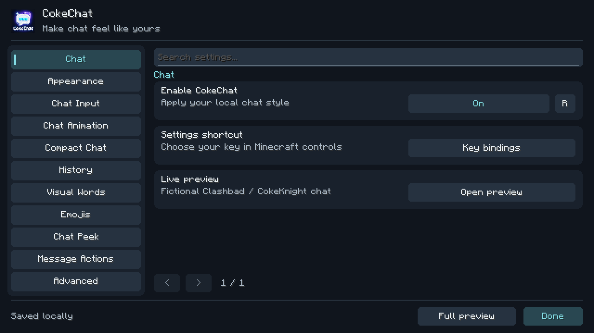

# CokeChat 1.5.0

Lokale Chat-Mod für **Minecraft Java 26.1.2**, **Fabric Loader 0.19.5+** und **Java 25**.

[Mod herunterladen](https://github.com/CokeKnightMods/CokeChat/releases/latest) · [Patchnotes](UPDATE-1.5.0.md) · [GUI und Bedienung](GUI-REDESIGN.md)



## Installation

1. Im Minecraft Launcher ein Fabric-Profil für **26.1.2** installieren und Java 25 verwenden.
2. `cokechat-1.5.0.jar` in den `mods`-Ordner dieses Profils kopieren; die ältere CokeChat-JAR vorher entfernen.
3. Minecraft starten. **F8** öffnet die Einstellungen. Im geöffneten Chat gibt es zusätzlich die Schaltfläche **CC**.

Die drei benötigten Fabric-API-Module sind in der JAR enthalten. Das vollständige Fabric API ist für CokeChat nicht zusätzlich nötig. Andere Mods dürfen es weiterhin verwenden.

## Funktionen

Neu in 1.5.0: Die gesamte GUI verwendet ein einheitliches Design mit responsiver Navigation, globaler Suche, klaren Einstellungs-Karten und konsistenten Editoren. Löschaktionen werden bestätigt; die lokale Vorschau ist zusätzlich per Tastatur bedienbar. Alle 91 bisherigen Einstellungen/Aktionen bleiben verfügbar. [Bedienstruktur und Dateiübersicht](GUI-REDESIGN.md) · [Patchnotes](UPDATE-1.5.0.md).

Seit 1.4.2: Compact Chat gruppiert Duplikate auch über dazwischenliegende Nachrichten hinweg. Siehe [Patchnotes](UPDATE-1.4.2.md).

Seit 1.4.1: Der Fokus-/Chat-Filter einschließlich AUTO, Dungeon, Kuudra und automatischer Run-Erkennung wurde vollständig entfernt. Alte Filterwerte werden ignoriert. Alle Nachrichten bleiben sichtbar, außer ausdrücklich manuell ausgeblendeten Einträgen.

Neu in 1.4.0:

- Custom Chat prüft den aktiven Fabric-Client-Dispatcher und den aktuellen Verbindungs-Dispatcher unabhängig. Vorschläge beider Quellen erscheinen gemeinsam; dynamische Provider und ihre Ersetzungsbereiche bleiben erhalten. Gültige Clientbefehle erhalten keine falsche Server-Fehlermeldung. Während der Eingabe eines Befehlsnamens erscheint kein großer Fehlerkasten. Kurze Argumenthinweise reservieren Platz unterhalb des Chatverlaufs. Das normale Absenden und die Client-/Server-Priorität bleiben unverändert.
- Copy Chat kopiert lesbaren Klartext ohne Minecraft-Farbcodes. Darstellung und gespeicherter Nachrichtentext bleiben erhalten.
- Chat Peek verwendet dieselbe Öffnungsanimation und dieselben Einstellungen wie Open Chat, einschließlich Distanz, Easing und Nachrichten-Fade.
- Unter **Appearance** sind **Chat Border**, **Input Field Border** und **Chat Side Bar / Scroll Bar** getrennt schaltbar. Scrollen und Eingabe funktionieren auch ohne sichtbare Ränder und Leisten.
- Compact Chat fasst gleich formatierte Nachrichten innerhalb des Zeitfensters auch über andere Nachrichten hinweg zusammen. Die Gruppe rückt zur neuesten Wiederholung. Das Zeitfenster beginnt mit jedem Duplikat erneut; Nachrichtenanimationen und die Leseposition bleiben erhalten.

Details und geprüfte Grenzen stehen in [UPDATE-1.4.0.md](UPDATE-1.4.0.md).

Seit 1.3.1: Befehlsvorschläge, Syntax- und Fehlerhinweise werden einmalig oberhalb des tatsächlichen Custom-Eingabefelds gezeichnet. Schriftgröße und Mauspositionen berücksichtigen die GUI-Skalierung; lange Texte werden umgebrochen und bei Platzmangel innerhalb des Popups scrollbar. Liegt das Eingabefeld direkt am oberen Bildschirmrand, wird während der Befehlseingabe vorübergehend Platz oberhalb reserviert. Gespeicherte Positionswerte bleiben erhalten. Tab, Pfeiltasten, Vorschlagsauswahl und Einfügen verwenden weiterhin Minecrafts ursprüngliche Befehlslogik.

Neu in 1.3.0:

- Öffnungsanimation mit Prozent-Presets, genauer Distanz, Dauer, vier Easings und separatem Nachrichten-Fade mit Verzögerung und Staffelung. Die endgültigen Chatmaße und Textumbrüche bleiben stabil.
- Ein zusammenhängender Hintergrund, unabhängig von neuen Nachrichtenanimationen. Beim Lesen älterer Nachrichten bleibt die sichtbare Zeile erhalten, auch bei Nachrichtenserien, umgebrochenen Compact-Gruppen und Chat Peek. Am unteren Rand folgt der Chat wieder neuen Nachrichten.
- Kategorie **Chat Input**: X/Y, Breite/Höhe, Schriftgröße, Farben und Rundung. **RELATIVE_TO_CHAT** misst vom linken unteren Chatpunkt, **ABSOLUTE_SCREEN** vom oberen linken Bildschirmrand. Die Grenzen bleiben innerhalb des Bildschirms.
- Separate Farbräder für Hintergrund, Rand, Standardtext, Scrollbar, Eingabefeld und Aktionssymbole. Jedes besitzt Helligkeit, Alpha, HEX (`#RRGGBB` / `#RRGGBBAA`) und RGB-Eingaben. Änderungen erscheinen live; **Apply** übernimmt, **Cancel/Escape** stellt den vorherigen Wert dieses Farbfelds wieder her, **Reset** lädt dessen Standard.
- Die lokale Vorschau bietet **Replay**, **New message** und **Duplicate** zum Prüfen der Animationen und Leseposition. Vorschau-Nachrichten werden niemals in den echten Chat eingefügt.

Bestehende Konfigurationen erhalten neue Standardfelder automatisch; vorhandene Emoji-, Visual-Words- und Darstellungswerte bleiben erhalten.

- Abgerundeter Chat-Hintergrund und Eingabebereich; Farbe, Transparenz, Radius, Breite, Höhe und Position sind einstellbar.
- Schriftgröße, Zeilenabstand und Scrollbar; echtes Compact Chat mit Duplikat-Zähler und konfigurierbarem Zeitfenster.
- 100, 500, 1.000, 5.000, 10.000 oder unbegrenzt viele Nachrichten; das Limit zählt Nachrichten einschließlich aller umgebrochenen Zeilen.
- Optionale lokale History pro Welt bzw. Server, standardmäßig **aus**. Wiederhergestellte Nachrichten tragen `[History]` und werden als lokale Texte ohne alte Signaturen oder klickbare Aktionen angezeigt.
- Sortierbare Visual-Word-Regeln mit Aktivierung, Groß-/Kleinschreibung und Ganzwortsuche. Höhere Regeln gewinnen bei Überschneidungen. Ersetzungen werden nicht rekursiv erneut durch Wortregeln verarbeitet.
- Vollständiger Standard-Katalog mit 1.914 Emojis: 1.911 lokale Apple-Bilder und drei Unicode-Fallbacks (`female_sign`, `male_sign`, `medical_symbol`). Keine Hauttonvarianten oder Hautton-Auswahl. Enthält Gesichter, Personen, Hände, Tiere, Essen, Gegenstände, Flaggen und zusammengesetzte Emojis.
- Emoji-Vervollständigung mit Pfeiltasten, Enter/Tab, Escape und Maus. Enter bei geöffneter Vorschlagsliste vervollständigt zuerst; es sendet noch nicht. Bei Befehlen bleibt die Vanilla-Vervollständigung zuständig.
- Durchsuchbare Emoji-Verwaltung mit Seitennavigation: nach Namen, Alias oder Emoji suchen; eigene Unicode-Zeichen oder lokale Bitmap-Fonts hinzufügen, ändern und eigene Überschreibungen entfernen.
- Live-Vorschau, direkt angewandte Einstellungen und eine größere Vorschauseite.

Die Einstellungsoberfläche ist englisch. Die Tastenzuweisung besitzt deutsche und englische Texte. Größere Einstellungsgruppen haben mehrere Seiten (`<` / `>`). F8 kann in Minecrafts Steuerungsmenü neu zugewiesen werden; im Chat dient F8 zusätzlich als direkter Shortcut.

## Lokale Dateien

Unter dem Minecraft-Spielverzeichnis:

```text
config/cokechat/config.json
config/cokechat/emojis.json
config/cokechat/history/<SHA-256-des-Welt-oder-Servernamens>.jsonl
```

Einstellungen werden atomar gespeichert. Eine beschädigte Konfiguration wird als `.broken-<Zeitstempel>` gesichert; CokeChat verwendet dann Standardwerte. History wird bei Änderungen ungefähr alle fünf Sekunden sowie beim Weltwechsel und beim Beenden gespeichert. Bei einem Absturz können die zuletzt noch nicht gespeicherten Nachrichten fehlen. „Clear history“ löscht den Verlauf des aktuellen Kontexts und die Vanilla-Anzeige. F3+D behält seine Vanilla-Bedeutung: Anzeige leeren; die optionale lokale Archivdatei wird dadurch nicht gelöscht.

„Unlimited“ bedeutet bewusst keinen künstlichen Grenzwert und benötigt entsprechend Arbeitsspeicher und bei aktivierter Persistenz Speicherplatz.

## Eigene Emojis

Für Unicode reicht **Emojis → Manage emojis → Add**, z. B. ID `star` und Unicode `★`.

Für eine Textur verwendet CokeChat Minecrafts lokale Bitmap-Fonts. Dadurch bleiben Textbreite, Umbruch, Baseline, Hover- und Klickpositionen im normalen Font-System. Ein vollständiges Beispiel liegt unter `examples/custom-emojis/`:

1. Den Ordner `CokeChat-Custom` aus dem Beispiel nach `resourcepacks` kopieren und im Spiel aktivieren.
2. In der Emoji-Verwaltung ID `badge`, Font `cokechat_custom:emoji` und Glyph `E100` eintragen; als Unicode-Fallback z. B. `♥` verwenden.
3. Nach Änderungen am Resource-Pack F3+T und anschließend **Emojis → Reload local definitions** benutzen.
4. `:badge:` erscheint lokal als Bitmap. Die Beispiel-PNG darf durch eine eigene Textur ersetzt werden. Höhe/Ascent/Breite des eigenen Fonts werden im Font-JSON bestimmt; die Größenoption der Mod gilt für ihre mitgelieferten Emojis.

Alternativ können mehrere Definitionen direkt in `config/cokechat/emojis.json` stehen:

```json
[
  {"id":"star","aliases":["sparkle"],"unicode":"★"},
  {"id":"badge","aliases":[],"unicode":"♥","font":"cokechat_custom:emoji","glyph":"\ue100","width":16,"height":16}
]
```

Unbekannte Codes bleiben Text. Fehlende Fonts oder Texturen führen zum Unicode-Fallback bzw. zum ursprünglichen Code. Ungültige lokale Definitionsdateien verhindern nicht das Laden der mitgelieferten Emojis. Benutzerdefinitionen können mitgelieferte IDs überschreiben; „Remove override“ stellt dann das mitgelieferte Emoji wieder her.

## Netzwerk und unveränderte Nachrichten

CokeChat registriert keine Payloads, verwendet keine Networking-API, öffnet keine Verbindungen und enthält keine Telemetrie, Update-Abfragen, Asset-Downloads oder Online-Datenbanken. Ausgehende Chat- und Befehlsmethoden werden nicht verändert. Wenn im Eingabefeld `gg :sob:` steht, sendet Minecraft weiterhin `gg :sob:` über seinen normalen Chatweg. Nur die empfangene lokale Darstellung wird verändert. Autocomplete fügt auf ausdrückliche Auswahl den sichtbaren Textcode ein, niemals eine gesonderte Nachricht.

Vanilla-Nachrichtenobjekte, Signaturen, Meldeinformationen, Chat-Tags, Klick-/Hover-Styles und Löschmarker bleiben im Speicher unverändert. Persistierte History ist dagegen ein lokales Klartextarchiv; spätere serverseitige Löschmarker entfernen bereits archivierten Klartext nicht rückwirkend. Das Archiv lässt sich über „Clear history“ löschen.

Die einzige mitgelieferte Fabric-API-Funktionalität besteht aus Basis-Events, Client-Lifecycle und Tastenbelegung. Netzwerkfähige Testmodule werden ausschließlich für die separaten Spieltests verwendet und sind **nicht** Teil der fertigen Mod. Minecraft selbst führt weiterhin seine normalen Verbindungen aus; dies ist keine Offline-Mod für Minecraft als Ganzes.

## Entwickeln und prüfen

Java 25 als `JAVA_HOME` setzen, dann:

```powershell
.\gradlew.bat build
.\gradlew.bat runClientGameTest
powershell -ExecutionPolicy Bypass -File tools/audit-network.ps1
```

Unter Linux/macOS: `sh ./gradlew build` bzw. `sh ./gradlew runClientGameTest`. Gradle lädt beim ersten Build die offiziellen Entwicklungsabhängigkeiten und Minecraft-Ressourcen. Diese Downloads gehören zum Build, nicht zur Mod-Laufzeit.

Quellstruktur: `chat` verarbeitet ausschließlich die Darstellung; `visualwords` und `emoji` sind getrennte Parser; `history` enthält lokale Speicherung und eine Random-Access-Deque; `rendering` zeichnet Hintergründe; `gui` enthält die Einstellungen; `mixin` enthält gezielte Vanilla-Eingriffe. Jeder Mixin dokumentiert seinen Zweck.

Die Core-Tests prüfen Parser, Limits, Persistenz, beschädigte Dateien, die History-Datenstruktur und verbotene Netzwerk-/Sende-Hooks. Die Client-Spieltests starten echtes Minecraft und eine lokale Testwelt, prüfen unveränderte Ein-/Ausgabetexte, 1.000 gespeicherte Nachrichten, Autocomplete und Clear History und erzeugen Screenshots. Logs und Testwelten liegen ausschließlich in den Entwicklungsverzeichnissen `run` bzw. `build/run`.

Verifizierte Versionen: Minecraft 26.1.2, Fabric Loader 0.19.5, Fabric API 0.155.3+26.1.2, Loom 1.17.21, Gradle 9.5.1, Java 25. Versionsbasis: [Fabric für 26.1](https://www.fabricmc.net/2026/03/14/261.html), [Fabric-Metadaten](https://meta.fabricmc.net/v2/versions/loader/26.1.2) und die offiziellen Maven-Artefakte.

Eigene Implementierung; kein Code oder Artwork aus Chatting. Die Emoji-Bilder stammen aus dem Apple-Set von emoji-data; Rechte und Quellen stehen in THIRD_PARTY.md und emoji-asset-sources.json. Siehe `LICENSE` und `THIRD_PARTY.md`.


## Emoji-Katalog 1.0.2

Der Katalog basiert auf Emoji 17.0 (emoji-data, Commit 13ee711e222ea17fe537bfea953c687866f16411). Die meisten Apple-PNGs stammen aus dem Paket 16.0.0; die acht neuen Standard-Emojis wurden aus dem genannten Commit ergänzt. Die drei Symbole ohne Apple-Bild verwenden Minecrafts Unicode-Schrift. Alle Hautton-Assets und Hautton-Codeeinträge wurden ausgeschlossen.

Codes wie `:thumbsup:`, `:pizza:`, `:rocket:`, `:orca:` und `:flag-de:` sowie direkt eingefügte Unicode-Emojis werden erkannt. Zusammengesetzte Unicode-Folgen werden als Ganzes verarbeitet. Eingefügte Hauttonmodifikatoren werden ausschließlich bei der lokalen Darstellung auf die Standardfarbe zurückgeführt. Das Original im Eingabefeld und der gesendete Text bleiben unverändert. Unbekannte Codes wie `:skin-tone-3:` bleiben normaler Text.

Die Emoji-Suche wertet den Katalog nur beim Ändern der Suche aus. Fonts sind in Seiten zu höchstens 64 Symbolen aufgeteilt. Quellen und Prüfsummen sämtlicher Bilder stehen in `emoji-asset-sources.json`.


## Neu in 1.1.0

- Das bereitgestellte CokeChat-Logo ist als Fabric-Mod-Icon eingebunden und erscheint in den Einstellungen.
- Moderne Sidebar mit neun Kategorien, globaler Suche über Namen/Beschreibungen, anklickbaren Suchergebnissen, Slidern, exakter Zahleneingabe (`=`), Auswahllisten, RGB-Farbauswahl, Textfeldern, Keybind-Verknüpfung und Reset pro Einstellung (`R`).
- **Compact Chat:** ausschließlich Time Window. Gruppen starten mit der ersten Nachricht und enden nach dem eingestellten Zeitraum (0,5 bis 300 Sekunden). Eine andere Nachricht dazwischen beendet die Gruppe: `A, B, A` bleibt in dieser Reihenfolge. Es gibt keinen Consecutive-Modus. Zählerformate verwenden `{count}`, etwa `×{count}`, `[{count}]`, `({count}x)` oder `x{count}`. Raw-History und ihre Limits zählen weiterhin alle Originale. Abschalten stellt die Einzelanzeigen wieder her.
- **Emoji-Favoriten:** Stern neben dem Emoji anklicken; mit `All emojis / Favorites` die Liste umschalten. Favoriten werden lokal gespeichert und im Autocomplete vor anderen passenden Treffern angezeigt. Alle Standardfarben und bisherigen Emojis bleiben erhalten.
- Run-Erkennung verwendet ausschließlich das lokale Sidebar-Scoreboard auf `hypixel.net` bzw. dessen Subdomains und eine SKYBLOCK-Überschrift. Catacombs-Floor/Run-Marker erkennen Dungeon, Kuudra's Hollow erkennt Kuudra. Fehlende, widersprüchliche oder unbekannte Daten ergeben NONE, auch bei Welt-/Serverwechsel. Keine Abfragen, Chat-Kommandos, APIs oder Pakete werden dafür gesendet.
- Run-Filter erkennen Party Chat, bekannte Boss-/NPC-Dialoge und strukturierte Run-Meldungen. Gewöhnlicher Spieler-, Guild- und Direktchat wird nicht durch bloße Erwähnung eines Bossnamens eingeblendet. Neue oder geänderte Hypixel-Meldungsformate können eine Anpassung der lokalen Erkennung erfordern. AUTO und Filter wurden mit Testdaten und lokalen Spieltests verifiziert; ein authentifizierter Live-Hypixel-Run wurde nicht getestet.
- Die Vorschau enthält ausschließlich lokale, fiktive englische Gaming-Trash-Talk-Dialoge zwischen Clashbad und CokeKnight, samt Wiederholungen, Emojis und Visual Words. Sie werden nie als Chat-Nachrichten abgesendet.

Bestehende 1.0.x-Konfigurationen werden mit Standardwerten für neue Optionen geladen. Die früheren Compact-Abstandsmodi entfallen; der Zeilenabstand bleibt unter Appearance einstellbar. Keine OneConfig-Codes, -Assets oder -UI-Ressourcen wurden übernommen.

## Neu in 1.2.0 — Animationen, Peek und Aktionen

- **Animations:** neue Nachrichten erscheinen mit einstellbarem Easing (Cubic Out, Quartic Out oder Ease Out) und 0–2.000 ms Dauer. Ein/Aus-Schalter und exakte Eingabe sind vorhanden. Duplikate behalten den Animationsbeginn ihrer Gruppe; Zähler-Updates starten den Einblendeffekt nicht neu.
- **Smooth Scrolling:** gemeinsame Scroll-Logik für Chat, Peek und Vorschau. Einstellbar sind Geschwindigkeit (0,25–30 Zeilen pro Mausradschritt), Dauer und Easing. Page Up/Down verwendet ebenfalls den weichen Übergang. Wiederholte Eingaben ändern das Ziel ohne Sprung am Animationsstart.
- **Shift-Präzision:** deutlich kleinere Scrollschritte mit konfigurierbarem Faktor (standardmäßig 0,25) und eigener Dauer. Shift während einer laufenden Bewegung loszulassen erhält den aktuellen Übergang; die nächste Eingabe verwendet wieder die normale Geschwindigkeit.
- **Chat Peek:** standardmäßig **rechte Shift-Taste halten**. Die Belegung lässt sich unter `Chat Peek → Key bindings` ändern. Eigene Breite, Höhe, X-Position, unterer Abstand, Hintergrund-Deckkraft und Ein-/Ausblenddauer. Der Peek ist ein Overlay und ersetzt den aktuellen Screen nicht. Er besitzt eine eigene Scrollposition und verwendet dieselben gefilterten/kompakten Nachrichten. Während Peek sichtbar ist, wird die normale Chatdarstellung vorübergehend verdeckt; Entwurf, Roh-History und normaler Scrollzustand bleiben erhalten.
- Im Spiel gibt Peek den Mauszeiger vorübergehend frei; nach dem Ausblenden wird die vorherige Maussteuerung wiederhergestellt. Er funktioniert auch über geöffneten GUIs. Im Overlay werden Scroll- und Mausaktionen lokal behandelt. Die als Peek-Taste verwendete Shift-Taste aktiviert nicht zugleich langsames Scrollen: Bei der Standardbelegung verwendet man **linke Shift** zusätzlich für Präzision.
- **Message Actions:** kleine Clipboard-/Papierkorb-Icons nur beim Hover, mit kurzem Fade und verzögerten Tooltips. Kopieren liefert genau einen Originaltext, ohne visuelle Wort-/Emoji-Ersetzungen oder Duplikat-Zähler. Löschen blendet die komplette aktuelle lokale Gruppe aus, auch bei umgebrochenem Text und im Peek. Die Originalobjekte, Signaturen und das optionale Rohtextarchiv werden nicht verändert. Ausblendungen gelten für den aktuellen lokalen Chat-Zustand und werden nicht als dauerhafte Löschung gespeichert.
- Größen, Deckkraft, Abstand, Copy/Delete-Sichtbarkeit, Animation und Tooltip-Verzögerung sind einstellbar. Die Icons werden auf die Zeilenhöhe begrenzt, damit kleine Schriftgrößen keine überlappenden Aktionsflächen erzeugen.
- **Interaktive Vorschau:** Clashbad/CokeKnight-Dialoge demonstrieren Gruppierung, Animation, Hover, Copy/Delete und weiches Scrollen. `Replay` setzt ausschließlich das lokale Vorschau-Beispiel zurück. Vorschau-Aktionen verändern keine echten Chat-Nachrichten.
- Zusätzliche Kategorien stehen über `Cats >` / `< Cats` oder die globale Suche zur Verfügung. Neue Einstellungen übernehmen bei alten Konfigurationsdateien sichere Standardwerte.

Animationen verwenden eine monotone Uhr. Nachrichten-/Gruppendaten, lokale Ausblendungen und Scroll-/Hover-Zustand sind getrennt. Peek-Zeilen werden nur bei geänderten Nachrichten oder Breite neu umgebrochen; die Vorschau cached ihre Layouts. Vanilla-Text, Styles und Tag-Verarbeitung bleiben erhalten; dieselben Koordinatenkorrekturen werden auf die vanilla Klick-Erkennung angewandt. Keine Chatting-Abhängigkeit, kein kopierter Code und keine fremden UI-Assets wurden hinzugefügt.
